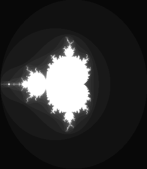
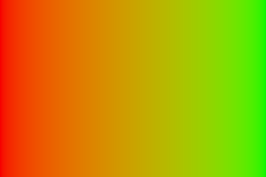

# 🐣 S1 | Prog: Workshop

**Ne garder que le vert**

**Échanger les canaux**

**Noir & Blanc**

**Négatif**

**Dégradé**

**Miroir**

**Image bruitée**

**Rotation de 90°**

**RGB split**

**Luminosité**
Avant :

 

Après :

**Disque+Cercle**

Ma fonction cercle est presque similaire à celle du disque. Il suffit de retirer le r2 et ses conditions dans le if pour obtenir un disque. J'ai décidé par la suite de mettre d'autres paramètres d'entrée dans la fonction afin de l'utiliser facilement dans la fonction rosace.

**Animation**

**Rosace**

**Mosaïque**

**Mosaïque miroir**

**Glitch**

**Tri de pixels**

**Fractale de Mandelbrot**

**Dégradés dans l'espace de couleur Lab**

**Convolution**

**Normalisation de l'histogramme**
Avant : 

Après : 

**Vortex**

**Filtre de Kuwaharas**

J'ai récupéré la fonction calculateStandardDeviation d'internet qui prenait en paramètre des tableaux de int que j'ai modifié en tableau de vec3.
