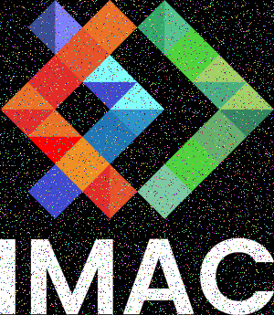
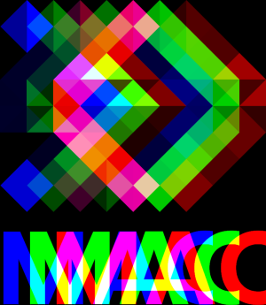
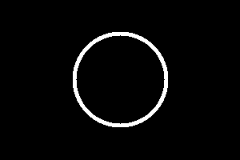
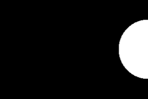
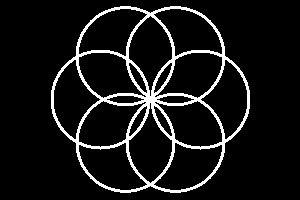

# 🐣 S1 | Prog: Workshop

**Ne garder que le vert**

**Échanger les canaux**

**Noir & Blanc**

**Négatif**

**Dégradé**

**Miroir**

**Image bruitée**

**Rotation de 90°**

**RGB split**

**Luminosité**

**Disque+Cercle**

**Animation**

**Rosace**

**Mosaïque**

**Mosaïque miroir**
**Glitch**
**Tri de pixels**
**Fractale de Mandelbrot**
**Dégradés dans l'espace de couleur Lab**
**Normalisation de l'histogramme**
**Vortex**
**Filtre de Kuwaharas**